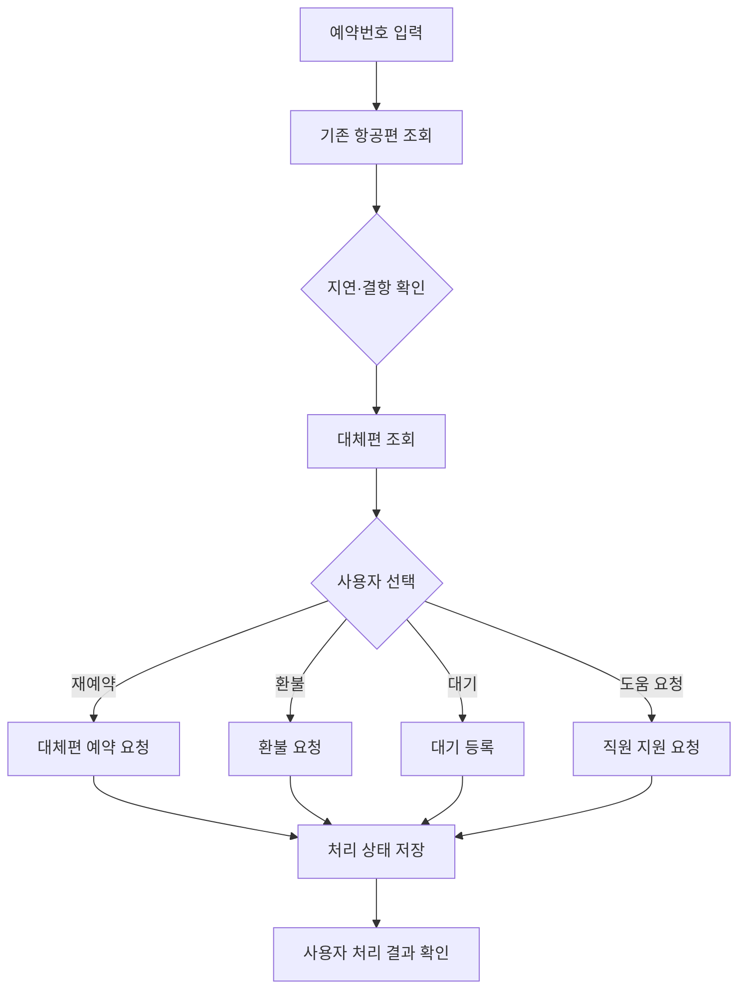
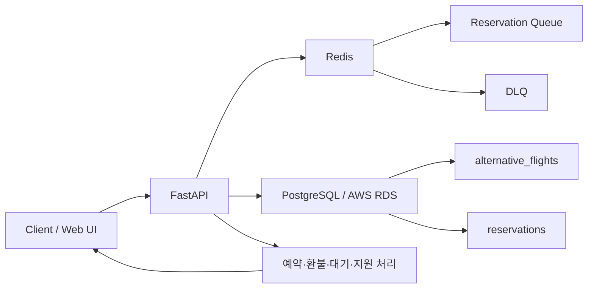

# SkyCare Disruption API
### 항공편 지연·결항 발생 시 고객이 대체편 조회부터 예약·환불까지 직접 처리할 수 있도록 설계한 Self-Service API

KT AIVLE School 프로젝트에서 항공편 지연·결항 상황의 고객 대응 과정을 하나의 서비스 흐름으로 구현한 프로젝트입니다.

기존에는 고객이 항공편 지연·결항을 확인한 뒤 대체편을 찾고, 예약·취소·환불을 처리하기 위해 여러 단계와 채널을 거쳐야 한다는 문제에 주목했습니다.  
SkyCare는 **예약 조회 → 대체편 추천 → 예약 → 환불/대기/도움 요청 → 처리 상태 확인**을 한 흐름에서 수행할 수 있도록 설계했습니다.

> 핵심 목표:  
> **고객의 지연·결항 확인부터 후속 처리 결과 확인까지 하나의 API 기반 서비스로 연결**

---

## 1. Problem

항공편 지연·결항이 발생하면 고객은 단순히 상황을 확인하는 것에서 끝나지 않습니다.

```text
지연·결항 확인
   ↓
대체편 탐색
   ↓
잔여 좌석 확인
   ↓
재예약
   ↓
취소·환불 또는 대기
   ↓
처리 상태 확인
```

이 과정이 여러 채널과 단계로 분리되면 고객은 같은 정보를 반복해서 확인해야 하고, 항공사 입장에서도 상담 요청이 집중될 수 있습니다.

SkyCare는 이러한 후속 절차를 **Self-Service 형태로 연결하는 것**을 목표로 했습니다.

---

## 2. 주요 기능

| 기능 | 설명 |
|---|---|
| 예약 조회 | 예약번호 기반 현재 항공편 정보 확인 |
| 대체편 조회 | 기존 항공편에 대응하는 대체편 및 잔여 좌석 조회 |
| 대체편 예약 | 선택한 대체편 예약 요청 처리 |
| 환불 요청 | 기존 항공권 환불 흐름 제공 |
| 대기 등록 | 잔여 좌석이 없을 경우 대기 요청 |
| 고객 도움 요청 | 직원 확인이 필요한 경우 별도 요청 |
| 처리 상태 확인 | 예약·환불·대기 등 후속 처리 상태 확인 |
| 공항 도착 안내 | 변경된 출발 시간을 기준으로 도착·체크인 안내 제공 |

---

## 3. Service Flow



---

## 4. Backend Architecture



현재 공개 코드에는 **FastAPI, Redis, PostgreSQL 연결 로직과 대체편·예약 테이블 초기화 구조**가 포함되어 있습니다.

---

## 5. 데이터 구조

### alternative_flights

대체편 후보를 저장하는 테이블입니다.

```text
reservation_no
flight_no
departure_time
arrival_time
remaining_seats
delay_hours
```

### reservations

대체편 예약 요청과 처리 상태를 관리합니다.

```text
request_id
flight_id
passenger_name
passenger_phone
status
created_at
```

대체편의 잔여 좌석은 0 미만이 되지 않도록 제약조건을 두어 잘못된 좌석 데이터가 저장되지 않도록 구성했습니다.

---

## 6. Queue / Failure Handling

예약 요청은 동시에 몰릴 수 있기 때문에 Redis 기반 Queue 구조를 고려했습니다.

```text
예약 요청
   ↓
Reservation Queue
   ↓
처리
   ├─ 성공 → 예약 상태 반영
   └─ 실패 → DLQ
```

환경변수로 Queue와 DLQ 이름을 분리해 관리하도록 구성했습니다.

```text
QUEUE_NAME=reservation_queue
DLQ_NAME=reservation_dlq
```

이를 통해 정상 처리와 실패 요청을 분리할 수 있도록 설계했습니다.

---

## 7. Fallback

외부 데이터나 DB 연결이 항상 정상이라는 전제만 두지 않았습니다.

대체편 데이터는 테스트 및 데모를 위해 fallback 데이터를 함께 제공하고, DB 초기화가 불가능한 경우 서비스 전체가 즉시 중단되지 않도록 예외 처리 구조를 두었습니다.

이 구조를 통해 개발·데모 환경에서도 주요 사용자 흐름을 확인할 수 있도록 했습니다.

---

## 8. Tech Stack

| 영역 | 기술 |
|---|---|
| Backend | Python / FastAPI |
| Validation | Pydantic |
| Queue | Redis |
| Database | PostgreSQL / psycopg2 |
| Cloud DB | AWS RDS |
| Deployment | AWS EC2 / Docker |
| Frontend Demo | HTML / JavaScript / Tailwind CSS |
| Configuration | Environment Variables |

---

## 9. Repository Structure

현재 공개 저장소는 핵심 구현과 데모 자료를 중심으로 구성되어 있습니다.

```text
skycare-disruption-api/
├── main.py                 # FastAPI / Redis / PostgreSQL / Web Demo
├── requirements.txt        # Python dependencies
├── presentation.pdf        # 프로젝트 발표자료
├── skycare_demo.mp4        # 서비스 데모
├── .gitignore
└── README.md
```

> 기존 저장소의 `main_py.txt`는 Python 코드이므로 GitHub 포트폴리오에서는 `main.py`로 변경하는 것을 권장합니다.

---

## 10. Run

```bash
git clone https://github.com/rlaqhfla0917-bit/skycare-disruption-api.git
cd skycare-disruption-api

python -m venv .venv
```

Windows:

```bash
.venv\Scripts\activate
```

macOS / Linux:

```bash
source .venv/bin/activate
```

패키지 설치:

```bash
pip install -r requirements.txt
```

환경변수 예시:

```env
REDIS_HOST=localhost
REDIS_PORT=6379

QUEUE_NAME=reservation_queue
DLQ_NAME=reservation_dlq

DB_HOST=
DB_NAME=postgres
DB_USER=postgres
DB_PASSWORD=
DB_PORT=5432

AUTO_INIT_DB=true
```

실행:

```bash
uvicorn main:app --reload
```

브라우저에서:

```text
http://127.0.0.1:8000
```

---

## 11. 프로젝트에서 고민한 점

이 프로젝트에서 중요하게 본 것은 단순히 API Endpoint를 만드는 것이 아니라 **지연·결항 이후 고객이 실제로 수행해야 하는 후속 절차를 하나의 서비스 흐름으로 연결하는 것**이었습니다.

특히 다음 세 가지를 중심으로 설계했습니다.

1. **대체편 탐색부터 예약·환불까지 사용자 흐름 연결**
2. **예약 상태와 잔여 좌석을 DB에서 관리**
3. **예약 처리 실패를 정상 요청과 분리할 수 있도록 Queue / DLQ 구조 고려**

이를 통해 고객이 항공편 상태를 확인한 뒤 다시 다른 채널을 찾지 않고, 필요한 후속 행동까지 이어갈 수 있는 Self-Service 구조를 구현했습니다.

---

## 12. Project Role

프로젝트에서 서비스 흐름과 장애 상황을 중심으로 구조를 설계했습니다.

- 지연·결항 이후 고객 Journey 정의
- 대체편 조회 → 예약 → 취소·환불 흐름 설계
- FastAPI 기반 API 서비스 구현 참여
- Redis Queue / DLQ 기반 비동기 처리 구조 설계
- RDS 기반 예약·대체편 데이터 관리
- 장애·실패 상황과 사용자 결과 확인 흐름 정의
- AWS 환경에서의 배포 구조 설계

---

## 13. What I Learned

이 프로젝트를 통해 서비스가 실제로 사용되기 위해서는 정상 처리 흐름뿐 아니라 **요청이 몰리는 상황, 처리 실패, 데이터 연결 실패와 같은 예외 상황까지 함께 설계해야 한다**는 점을 배웠습니다.

또한 API는 하나의 기능을 제공하는 데서 끝나는 것이 아니라, DB·Queue·Cloud 환경과 연결되어 **사용자가 처음 요청한 시점부터 최종 결과를 확인하는 시점까지 일관된 상태를 관리해야 한다**는 점을 경험했습니다.

---

## Project Context

KT AIVLE School  
Flight Disruption Self-Service API / FastAPI / Redis / PostgreSQL / AWS
